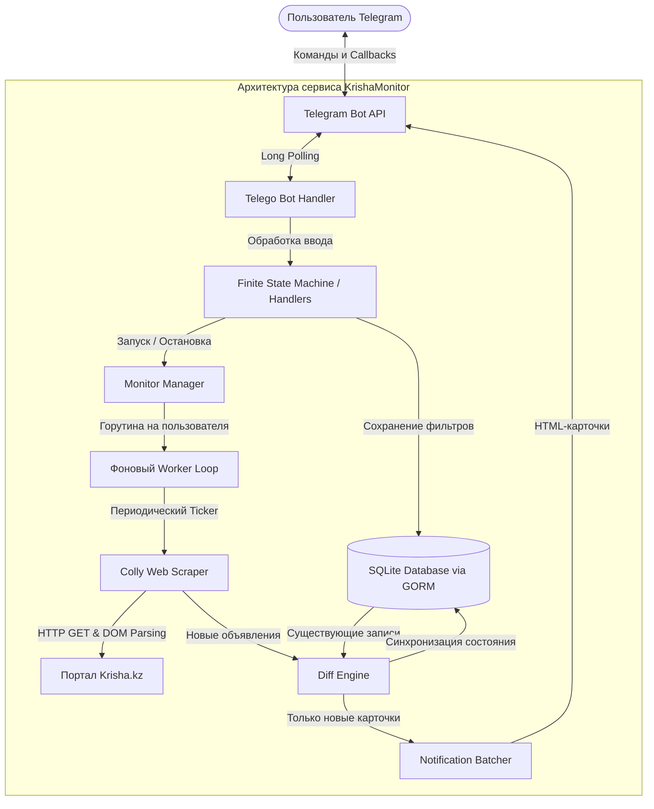
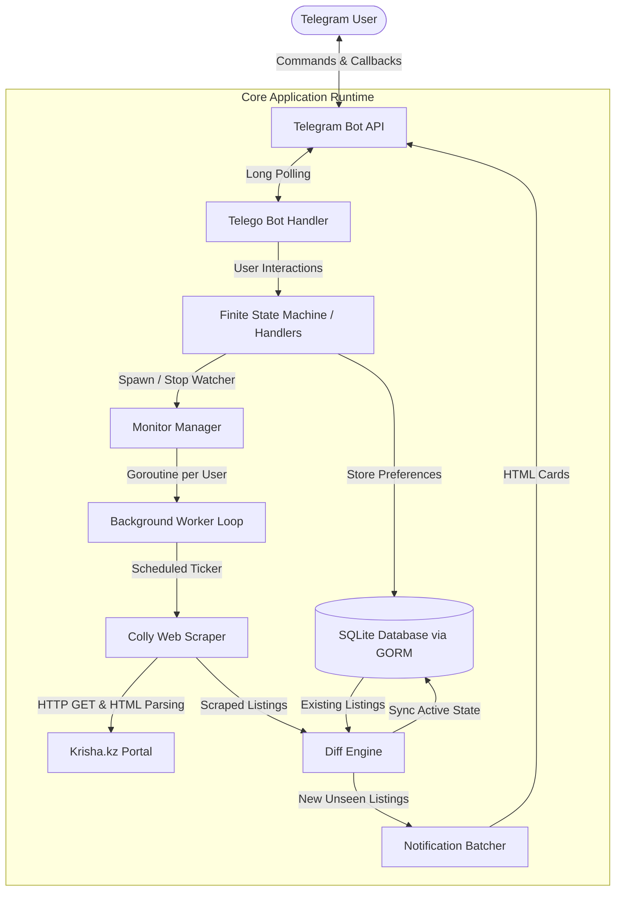

# Krisha monitor

**Высокопроизводительный Telegram-бот для мониторинга аренды недвижимости на [Krisha.kz](https://krisha.kz)**  
*High-Performance Real Estate Monitoring & Instant Alert Bot for [Krisha.kz](https://krisha.kz)*

[](https://golang.org)
[](https://www.docker.com/)
[](https://gorm.io)
[](https://github.com/mymmrac/telego)
[](https://github.com/gocolly/colly)
[](LICENSE)

<br>

**Language / Язык:**  
[**Русский**](#-krishamonitor---русский) • [**English**](#-krishamonitor---english)

---

<a id="-krishamonitor---русский"></a>
# Русский

<b>Больше никаких упущенных выгодных предложений по аренде.</b><br>
KrishaMonitor непрерывно в фоновом режиме парсит новые объявления по заданным фильтрам, вычисляет разницу (diff) и мгновенно отправляет уведомления в Telegram до того, как квартиру заберут другие.

[Ключевые возможности](#ключевые-возможности) •
[Архитектура системы](#архитектура-системы) •
[Инженерные решения](#инженерные-решения) •
[Стек технологий](#стек-технологий) •
[Быстрый старт](#быстрый-старт) •
[Структура проекта](#структура-проекта)

---

## Проблема и решение

* **Проблема:** Рынок аренды недвижимости в крупных городах (например, Астане и Алматы) чрезвычайно динамичен. Ликвидные и выгодные варианты сдаются за считанные часы или даже минуты. Ручное обновление сайта отнимает много времени и часто приводит к упущенным сделкам.
* **Решение:** **KrishaMonitor** — асинхронный сервис мониторинга и Telegram-бот на Go. Пользователь через удобный интерфейс задает критерии поиска (город, район, бюджет), а бот запускает изолированный воркер с пагинацией и механизмом диффинга, присылая карточки только новых объявлений в реальном времени.

---

## Ключевые возможности

- **Интерактивный UI Telegram (FSM):** Пошаговый сценарий настройки через Inline-кнопки (город, район, диапазон цен) с сохранением состояния.
- **Конкурентный фоновый мониторинг:** Для каждого пользователя создается персональная горутина и `time.Ticker`, обеспечивая независимый цикл опроса без блокировки основного потока бота.
- **Парсер на базе Colly:** Эмуляция браузерных заголовков, глубина пагинации до 5 страниц и извлечение детальных параметров (комнаты, этаж, площадь, цена, фото).
- **Differential State Engine (Smart Diff):** Сравнение свежего парсинга с базой данных в памяти ($O(N + M)$). Предотвращает дубли уведомлений и удаляет неактуальные объявления.
- **Пакетная отправка сообщений:** Группировка объявлений в аккуратные HTML-сообщения со ссылками и метаданными с учетом лимитов Telegram API.
- **Multi-Stage Docker:** Минималистичный и безопасный образ (`golang:1.24` $\rightarrow$ `debian:bookworm-slim`) с сохранением базы данных в томах (Volumes).
- **Unit-тестирование:** Табличные тесты для парсинга цен, деструктуризации строк и валидации обернутых ошибок (`errors.As`).

---

## Архитектура системы



---

## Инженерные решения

### 1. Управление жизненным циклом горутин и конкурентность
Каждый активный монитор запускается в отдельной горутине под управлением потокобезопасного реестра (`sync.Mutex` / `sync.RWMutex`). Воркер слушает каналы управления (`chan string`) и контекст отмены для корректного завершения (Graceful Shutdown) при команде `/cancel`:

```go
// Воркер слушает тикер и канал остановки
select {
case <-goCtx.Done():
    return
case cmd := <-monitor.CommandChan:
    if cmd == "stop" {
        return
    }
case <-monitor.Ticker.C:
    // Запуск цикла парсинга и отправка обновлений
}
```

### 2. Алгоритм диффинга объявлений (`processFlats`)
Для предотвращения спама и лишней нагрузки используется хэш-маппинг списков:
* **Новые объявления:** Сохраняются в БД и немедленно отправляются пользователю.
* **Удаленные/устаревшие объявления:** Очищаются из базы данных, оптимизируя дисковое пространство.

### 3. Сценарий конечного автомата (FSM)
1. `/start` $\rightarrow$ Приветствие и знакомство с функционалом.
2. `/monitor` $\rightarrow$ Выбор города $\rightarrow$ Выбор района $\rightarrow$ Ввод диапазона цен (прим. `150000-250000`).
3. Подтверждение данных $\rightarrow$ Старт фонового воркера.
4. `/cancel` $\rightarrow$ Остановка воркера, закрытие каналов и очистка памяти.

---

## Стек технологий

| Компонент | Технология | Обоснование выбора |
| :--- | :--- | :--- |
| **Язык** | **Go (Golang 1.24)** | Строгая типизация, минимальное потребление RAM, высокая скорость и встроенная конкурентность. |
| **Telegram фреймворк** | **Telego** | Типобезопасная и быстрая библиотека Telegram Bot API с удобным роутингом обновлений. |
| **Скрапинг данных** | **Colly** | Быстрый и расширяемый фреймворк для веб-скрапинга и парсинга DOM-дерева. |
| **ORM и База данных** | **GORM + SQLite3** | Встраиваемая база данных с автоматическими миграциями моделей. |
| **Контейнеризация** | **Docker & Compose** | Многоэтапная сборка для изоляции окружения и минимизации размера контейнера. |
| **Тестирование** | **Go `testing`** | Табличные Unit-тесты для валидации вспомогательных функций и обработки ошибок. |

---

## Структура проекта

```text
krishaMonitor/
├── database/            # Подключение к БД, модели GORM и CRUD-операции
│   ├── database.go      # Инициализация SQLite, автомиграции и запросы
│   └── models.go        # Модели User и Flat
├── handlers/            # Обработчики команд и callback-запросов бота
│   └── handlers.go      # FSM (конечный автомат) диалога с пользователем
├── helpers/             # Вспомогательные функции (парсинг строк и цен)
│   └── helpers.go
├── logger/              # Потокобезопасный файловый логгер с фильтрацией
│   ├── logger.go
│   └── var.go
├── middleware/          # Менеджер воркеров и фоновые процессы мониторинга
│   ├── data.go          # Структуры мониторов и справочники районов
│   └── middleware.go    # Циклы опроса и группировка уведомлений
├── parser/              # Логика скрапера на Colly и построение URL
│   ├── data.go          # Константы и базовые эндпоинты
│   ├── helpers.go       # Генерация поисковых ссылок с фильтрами
│   └── parser.go        # Парсинг страниц, пагинация и diff-алгоритм
├── testing/             # Набор табличных тестов
│   └── helpers_test.go
├── Dockerfile           # Multi-stage сборка приложения
├── docker-compose.yml   # Запуск с маппингом логов и базы данных
├── main.go              # Точка входа в приложение и DI
└── go.mod               # Зависимости проекта
```

---

## Быстрый старт

### Требования
- [Go 1.24+](https://golang.org/dl/) или [Docker & Docker Compose](https://www.docker.com/)
- Токен Telegram-бота от [@BotFather](https://t.me/BotFather)

### Вариант 1: Запуск через Docker (Рекомендуемый)

1. **Клонируйте репозиторий:**
   ```bash
   git clone https://github.com/yourusername/krishaMonitor.git
   cd krishaMonitor
   ```

2. **Создайте файл `.env`:**
   ```env
   TELEGRAM_BOT_TOKEN=123456789:ABCdefGHIjklMNOpqrSTUvwxYZ
   ```

3. **Запустите контейнер:**
   ```bash
   docker compose up -d --build
   ```

4. **Просмотр логов:**
   ```bash
   docker compose logs -f
   ```

---

### Вариант 2: Локальный запуск

1. **Установите зависимости:**
   ```bash
   go mod download
   ```

2. **Экспортируйте токен:**
   ```bash
   export TELEGRAM_BOT_TOKEN="ваш_токен_бота"
   ```

3. **Запустите приложение:**
   ```bash
   go run main.go
   ```

---

## Переменные окружения

| Переменная | Обязательна | Описание | Пример |
| :--- | :--- | :--- | :--- |
| `TELEGRAM_BOT_TOKEN` | **Да** | Токен бота от BotFather | `712345678:AAF...` |

---

<br>
<br>

---

<a id="-krishamonitor---english"></a>
# English

<b>Never miss a high-demand rental apartment again.</b><br>
KrishaMonitor runs continuous, concurrent background scraping routines to detect newly listed properties matching custom user criteria, delivering real-time Telegram alerts before competitive listings disappear.

[Key Features](#key-features-en) •
[System Architecture](#system-architecture-en) •
[Engineering Highlights](#engineering-highlights-en) •
[Tech Stack](#tech-stack-en) •
[Quick Start](#quick-start-en) •
[Project Structure](#project-structure-en)

---

## The Problem & Solution

* **The Problem:** The rental real estate market in major metropolitan areas (such as Astana and Almaty) moves fast. Under-priced or high-demand apartments are often rented within hours of publication. Manually refreshing marketplace pages is tedious, inefficient, and leads to missed opportunities.
* **The Solution:** **KrishaMonitor** is an automated, concurrent scraping daemon and Telegram bot written in Go. It enables users to set up personalized search criteria (city, district, price brackets) via an interactive UI, scrapes real-time listings with pagination and diffing algorithms, and delivers instant notifications the second a new matching listing is published.

---

<a id="key-features-en"></a>
## Key Features

- **Interactive Telegram UI (FSM):** Guided onboarding using inline keyboards to configure city, district, and target price ranges with full state management.
- **Concurrent Per-User Background Watchers:** Dedicated Goroutines and `time.Ticker` instances for isolated, multi-tenant monitoring loops without blocking the bot runtime.
- **Resilient Web Scraping Engine:** Powered by Colly with realistic HTTP headers, automated pagination (up to 5 pages deep), and robust DOM parsing.
- **Smart Differential Engine:** Real-time diffing between scraped listings and cached database records — prevents duplicate alerts and tracks delisted properties.
- **Zero-Spam Batch Notifier:** Chunks and formats listings into clean, readable HTML Telegram cards with direct links and property parameters (rooms, floor, area).
- **Production-Ready Multi-Stage Docker:** Lightweight, secure container build with persistent SQLite volume storage and structured file logging.
- **Table-Driven Unit Tests:** Rigorous testing of parsing algorithms, error handling, and type destructuring.

---

<a id="system-architecture-en"></a>
## System Architecture



---

<a id="engineering-highlights-en"></a>
## Engineering Highlights

### 1. Concurrency & Goroutine Lifecycle Management
Each active monitor runs as an independent Goroutine orchestrated through a thread-safe registry (`sync.Mutex` / `sync.RWMutex`). Monitoring workers listen to command channels (`chan string`) and context cancellations to ensure graceful teardown when users execute `/cancel` or update filters:

```go
// Worker listens on Ticker & Graceful Stop Channel
select {
case <-goCtx.Done():
    return
case cmd := <-monitor.CommandChan:
    if cmd == "stop" {
        return
    }
case <-monitor.Ticker.C:
    // Execute scrape cycle & dispatch updates
}
```

### 2. Differential state tracking (`processFlats`)
To eliminate notification spam, the scraper applies an $O(N + M)$ map-based reconciliation algorithm comparing newly fetched listings against historical database records for that user:
* **Added listings:** Saved to DB and dispatched to Telegram.
* **Delisted or expired listings:** Automatically cleaned up from the database to conserve storage.

### 3. Finite state machine (FSM) workflow
Users navigate through a seamless setup dialog:
1. `/start` $\rightarrow$ Bot introduction and feature overview.
2. `/monitor` $\rightarrow$ City selection $\rightarrow$ District selection $\rightarrow$ Budget bounds.
3. Confirmation dialog $\rightarrow$ Starts asynchronous scraping routine.
4. `/cancel` $\rightarrow$ Instantly terminates the background worker and releases resources.

---

<a id="tech-stack-en"></a>
## Tech stack

| Component | Technology | Rationale |
| :--- | :--- | :--- |
| **Language** | **Go (Golang 1.24)** | Compiled, low memory footprint, first-class concurrency primitives. |
| **Telegram Framework** | **Telego** | Fast, type-safe Telegram Bot API library with built-in routing and long polling. |
| **Scraping Engine** | **Colly** | High-performance scraping framework with CSS selector query capabilities. |
| **ORM & Database** | **GORM + SQLite3** | Lightweight zero-config embedded SQL database with automatic migrations. |
| **Containerization** | **Docker & Compose** | Multi-stage build (`golang:alpine` $\rightarrow$ `debian:slim`) for minimal image footprint. |
| **Testing** | **Go `testing`** | Table-driven unit tests for string destructuring, conversions, and error wrapping. |

---

<a id="project-structure-en"></a>
## Project structure

```text
krishaMonitor/
├── database/            # Database initialization, GORM models & query helpers
│   ├── database.go      # CRUD operations and migration setup
│   └── models.go        # User and Flat data models
├── handlers/            # Telegram bot command and callback query handlers
│   └── handlers.go      # User onboarding FSM, state transitions & dialogs
├── helpers/             # Utility functions (string parsing, pricing normalizers)
│   └── helpers.go
├── logger/              # Custom thread-safe file logger with debug filters
│   ├── logger.go
│   └── var.go
├── middleware/          # Monitoring manager, background workers & state storage
│   ├── data.go          # City/district lookup tables & monitor structs
│   └── middleware.go    # Asynchronous worker loops & batch dispatchers
├── parser/              # Colly web-scraper implementation & URL builders
│   ├── data.go          # Base URLs and endpoints
│   ├── helpers.go       # Query string formatting
│   └── parser.go        # DOM extraction, pagination & diff algorithms
├── testing/             # Table-driven test suites
│   └── helpers_test.go
├── Dockerfile           # Multi-stage container build
├── docker-compose.yml   # Volume mapping and environment orchestration
├── main.go              # Application entrypoint & dependency injection
└── go.mod               # Go modules definition
```

---

<a id="quick-start-en"></a>
## Quick start

### Prerequisites
- [Go 1.24+](https://golang.org/dl/) or [Docker & Docker Compose](https://www.docker.com/)
- A Telegram Bot Token from [@BotFather](https://t.me/BotFather)

### Option 1: Running with Docker (Recommended)

1. **Clone the repository:**
   ```bash
   git clone https://github.com/artcevvv/krishaMonitor.git
   cd krishaMonitor
   ```

2. **Configure environment variables:**
   Create a `.env` file in the root directory:
   ```env
   TELEGRAM_BOT_TOKEN=123456789:ABCdefGHIjklMNOpqrSTUvwxYZ
   ```

3. **Start the service:**
   ```bash
   docker compose up -d --build
   ```

4. **Inspect logs:**
   ```bash
   docker compose logs -f
   ```

---

### Option 2: Running locally

1. **Install dependencies:**
   ```bash
   go mod download
   ```

2. **Set environment variables:**
   ```bash
   export TELEGRAM_BOT_TOKEN="your_bot_token_here"
   ```

3. **Run the application:**
   ```bash
   go run main.go
   ```

---

## Configuration and environment

| Variable | Required | Description | Example |
| :--- | :--- | :--- | :--- |
| `TELEGRAM_BOT_TOKEN` | **Yes** | Telegram Bot API Token obtained from @BotFather | `712345678:AAF...` |

---

## Roadmap and future improvements

- [ ] **Multi-City Support:** Expand preset district datasets to Almaty, Shymkent, and other major cities.
- [ ] **Configurable Intervals:** Allow users to set custom scraping polling frequencies (e.g., 5m, 15m, 30m, 1h).
- [ ] **Filter Extension:** Support filters for number of rooms, building material, and renovated apartments.
- [ ] **Distributed Deployment:** Migration from SQLite to PostgreSQL + Redis for distributed scraping workers across multiple nodes.
- [ ] **Proxy Rotation:** Anti-bot bypass proxy pool support for high-frequency scraping.

---

## Author

Developed with a headache of searching for new apartment by [**artcevvv**](https://artcevvv.com) 
*Passionate Fullstack Software Engineer building robust, scalable systems and developer tools.*  
*(And also just a guy who was tired of missing good deals on Krisha)*

- **GitHub:** [@artcevvv](https://github.com/artcevvv)
- **LinkedIn:** [linkedin.com/in/artcevvv](https://linkedin.com/in/artcevvv)
- **Site:** [artcevvv.com](https://artcevvv.com)

---

## License

This project is licensed under the MIT License - see the [LICENSE](LICENSE) file for details.
